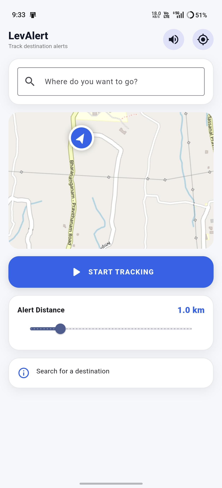
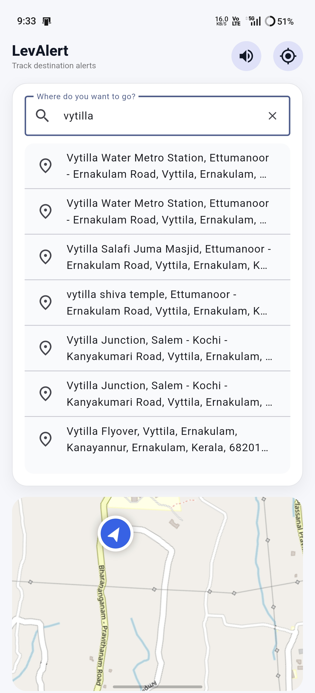
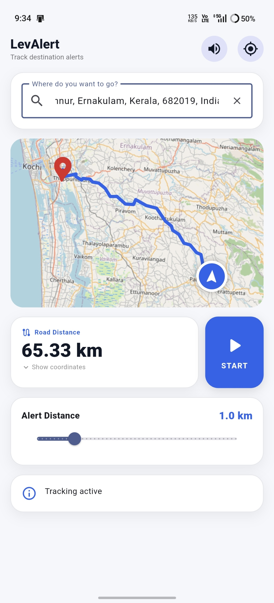
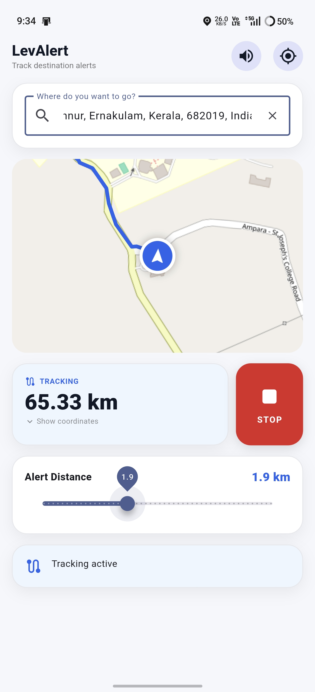

<div align="center">
# 📍 LevAlert

### Smart Location-Based Alarm built with Flutter

Never miss your stop again. LevAlert tracks your journey in real time and alerts you when you're close to your destination.




</div>

---

# ✨ Features

- 🔍 Smart destination search (OpenStreetMap / Nominatim)
- 🗺️ Interactive live map
- 📍 Live GPS tracking
- 🛣️ Real road-distance routing
- 📌 Destination marker & current location marker
- 📏 Adjustable alert distance slider
- 🔔 Alarm when nearing destination
- 📳 Phone vibration support
- 🔊 Device ringtone support
- 🔔 Local notifications
- 📍 Auto-follow navigation mode
- 🎯 Real-time distance updates

---

# 📱 Screenshots

| Home | Search |
|------|------|
|  |  |

| Tracking | Alarm |
|------|------|
|  |  |

---

# 🛠️ Built With

- Flutter
- Dart
- flutter_map
- Geolocator
- OpenStreetMap
- Nominatim API
- TomTom Routing API
- Flutter Local Notifications
- Flutter Ringtone Player
- Vibration

---

# 🚀 Installation

Clone the repository

```bash
git clone https://github.com/levissisac/LevAlert.git
```

Move into the project

```bash
cd LevAlert
```

Install dependencies

```bash
flutter pub get
```

Run the app

```bash
flutter run
```

---

# 📂 Project Structure

```
lib/
 ├── main.dart
 ├── services/
 ├── widgets/

screenshots/
android/
ios/
```

---

# 🎯 Future Improvements

- Dark Mode
- Offline Maps
- Multiple Saved Destinations
- Route History
- WearOS Support
- Background Tracking
- Voice Navigation

---

# 👨‍💻 Author

**Levis S Isac**

GitHub: https://github.com/levissisac

---

# ⭐ Support

If you like this project, consider giving it a ⭐ on GitHub!

It helps others discover the project and motivates future development.
