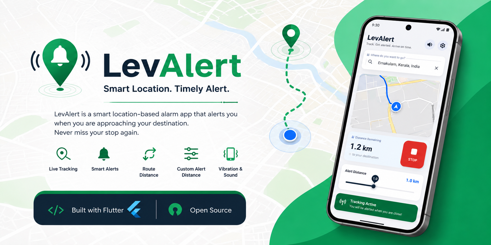

<p align="center">
  
</p>

<h1 align="center">📍 LevAlert</h1>

<p align="center">
Smart Location-Based Alarm App built with Flutter 🚀  
Never miss your stop again — LevAlert alerts you when you're near your destination.
</p>

<p align="center">
  
  
  
  
</p>

---

## ✨ Features

- 🔍 Smart place search (OpenStreetMap / Nominatim API)
- 📍 Live GPS tracking
- 🗺️ Interactive map view (flutter_map)
- 📌 Destination + current location markers
- 🛣️ Route line between you and destination
- 📏 Adjustable alert distance (slider control)
- 🔔 Automatic alarm trigger near destination
- 📳 Vibration support
- 🔊 Device ringtone support (built-in sounds)
- 🔔 Local notifications support
- 🎯 Real-time distance updates
- 🚀 Auto-follow navigation mode

---

## 📱 Screenshots

### Home Screen
<p align="center">
  
</p>

### Search Screen
<p align="center">
  
</p>

### Tracking Screen
<p align="center">
  
</p>

### Alarm Screen
<p align="center">
  
</p>

---

## 🛠️ Built With

- Flutter
- Dart
- flutter_map
- Geolocator
- OpenStreetMap (Nominatim)
- TomTom Routing API
- flutter_local_notifications
- vibration package
- audioplayers (for sound support)

---

## 🚀 Getting Started

### 1. Clone the repository
```bash
git clone https://github.com/levissisac/LevAlert.git
```

### 2. Move into project
```bash
cd LevAlert
```

### 3. Install dependencies
```bash
flutter pub get
```

### 4. Run the app
```bash
flutter run
```

---

## 📂 Project Structure

```
lib/
 ├── main.dart
 ├── screens/
 ├── services/
 ├── widgets/
assets/
 ├── banner.png
screenshots/
 ├── home.png
 ├── search.png
 ├── tracking.png
 ├── alarm.png
```

---

## 🔊 Alarm System

- Uses **device built-in ringtones**
- Plays sound when within alert distance
- Vibration triggers simultaneously
- Stops when user presses STOP button

---

## 📏 Alert Distance Feature

- Slider range: **0.1 km → 5 km**
- Real-time distance recalculation
- Auto-trigger alarm when threshold is reached

---

## 🔮 Future Improvements

- 🌙 Dark mode UI
- 📴 Offline maps support
- 🧭 Turn-by-turn navigation
- 📍 Saved destinations
- ⌚ WearOS support
- 🔁 Background tracking service

---

## 👨‍💻 Author

**Levis S Isac**

GitHub: https://github.com/levissisac

---

## ⭐ Support

If you like this project:
- ⭐ Star the repo
- 🍴 Fork it
- 🚀 Share it

It really helps :)
